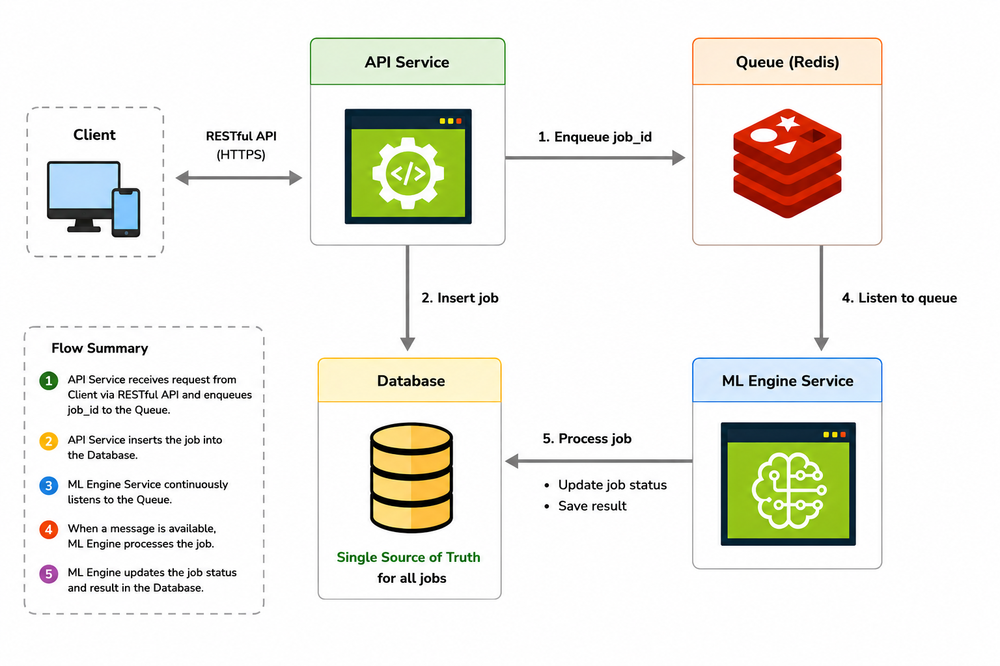
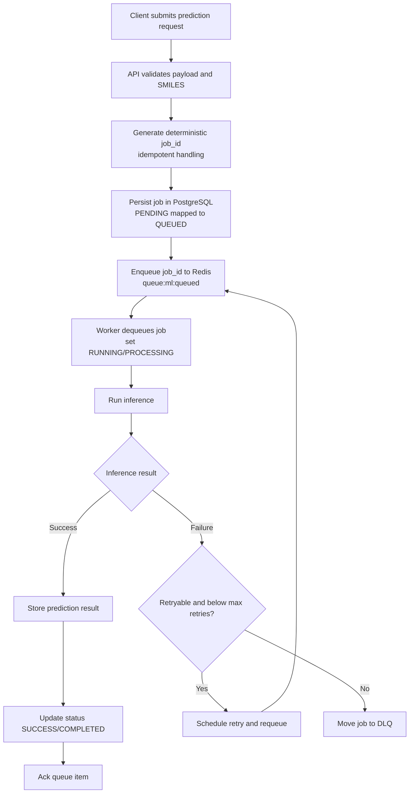

# Demo API Jelajah Medika (DTI)

An asynchronous backend service for Drug-Target Interaction (DTI) prediction built with FastAPI and an ML worker.

## Core Technologies

[](https://www.python.org/)
[](https://fastapi.tiangolo.com/)
[](https://www.uvicorn.org/)
[](https://docs.pydantic.dev/)
[](https://www.sqlalchemy.org/)
[](https://www.postgresql.org/)
[](https://redis.io/)
[](https://alembic.sqlalchemy.org/)
[](https://pytorch.org/)
[](https://www.rdkit.org/)
[](https://numpy.org/)
[](https://www.docker.com/)
[](https://pytest.org/)
[](https://www.structlog.org/)

## Showcase Goal

This project demonstrates production-style backend patterns for asynchronous ML workloads:
- Responsive API (`202 Accepted`) for inference requests.
- Dedicated worker for heavy background processing.
- Reliability through retries, backoff, and a dead-letter queue (DLQ).

## Architecture Summary



Main components:
- `client`: Frontend application or end user that interacts with the system.
- `api_service`: FastAPI producer that receives requests, creates prediction jobs, enqueues `job_id`, and returns job status endpoints.
- `ml_engine_service`: Background worker that consumes queue messages, performs inference, and updates job status/results.
- `database`: Persistent job storage and the single source of truth.
- `redis`: Queue transport for asynchronous processing (`queued`, `processing`, `retry`, `dlq`).

Boundaries:
- `api_service` does not import or depend on worker internal modules.
- `ml_engine_service` does not import or depend on API internal modules.


## API Endpoints to Showcase

Base URL: `http://localhost:<API_PORT>`

- `POST /api/v1/predictions`
  - Submit a prediction job (`202 Accepted`).
- `GET /api/v1/jobs/{job_id}`
  - Check job status (`PENDING`, `RUNNING`, `SUCCESS`, `FAILED`) and result/error.
- `GET /api/v1/queues/metrics`
  - Inspect queue depth (`queued`, `processing`, `retry`, `dlq`).
- `GET /health/db`
  - Database health check.

## End-to-End Workflow

There are success path and failed path.
Success path .. and failure path : retryable or no retry .

here is general flow of the workflow inludng all of those.



1. Client submits a prediction request to the API.
2. API validates payload + SMILES.
3. API generates a deterministic `job_id` (idempotent request handling).
4. API persists the job in PostgreSQL (initial status `PENDING`, mapped to `QUEUED`).
5. API enqueues `job_id` to Redis queue `queue:ml:queued`.
6. Worker consumes the queue, updates status to `RUNNING`/`PROCESSING`, and runs inference.
7. On success: store result, update status to `SUCCESS`/`COMPLETED`, and ack queue item.
8. On failure: retry or move to DLQ based on policy.


## Queue Flow and Reliability

Queue keys:
- `queue:ml:queued`
- `queue:ml:processing`
- `queue:ml:retry`
- `queue:ml:dlq`

Success path:
1. Worker processes job.
2. `clear_retry_count(job_id)`.
3. `ack(job_id)` removes it from `processing`.

Failure path:
1. Worker classifies error as retryable vs non-retryable.
2. Non-retryable errors: immediate `move_to_dlq(job_id)`.
3. Retryable errors: `increment_retry_count(job_id)`.
4. If retry count exceeds `ML_MAX_RETRIES`: move to DLQ.
5. Otherwise: `requeue(job_id, available_at_epoch)` to `retry` using exponential backoff + jitter.
6. Due jobs in `retry` are promoted back to `queued` via `promote_retry()`.

### Failure Simulation Mode (for reliability testing)

The system includes a fault-injection mode to intentionally make inference outcomes non-reliable.

- Set `ML_WORKER_SIMULATE_TIMEOUT_50_50=1` to enable random timeout simulation in the worker.
- In this mode, each job has a 50% chance to fail with a simulated timeout before inference runs.
- Purpose: validate retry, backoff, and DLQ behavior when failures happen in real operation.
- Do not enable this mode in production.

## Idempotency

Duplicate requests are handled in the create use case:
- Request is normalized into a canonical payload.
- `request_hash` is generated (SHA-256).
- Deterministic UUID (`uuid5`) is generated as `job_id`.
- If `job_id` already exists, API returns the existing job instead of creating a new one.

## Project Structure

```text
demo-api-jelajah-medika/
  apps/
    api_service/
    ml_engine_service/
    shared/
  alembic/
  docker/
  scripts/
  static/
  README.md
```

## Quick Start (Docker)

1. Prepare env file:
```bash
cp .env.docker.example .env.docker
```

2. Start services:
```bash
docker compose --env-file .env.docker -f docker/docker-compose.dev.yml up --build
```

3. Open API docs:
- `http://localhost:<API_PORT>/docs`

## Short Demo Commands

1. Submit prediction:
```bash
curl -X POST http://localhost:18000/api/v1/predictions \
  -H 'Content-Type: application/json' \
  -d '{
    "smiles": "CCO",
    "dataset_name": "davis",
    "model_version": "gnn_v1",
    "options": {
      "top_k": 5,
      "return_sequences": false
    }
  }'
```

2. Poll status:
```bash
curl http://localhost:18000/api/v1/jobs/<job_id>
```

3. Queue metrics:
```bash
curl http://localhost:18000/api/v1/queues/metrics
```

## Worker Runbook (Short)

Entry point:
```bash
python -m apps.ml_engine_service.src.worker.queue_worker
```

Required env:
- `DATABASE_URL`

Main optional env:
- `REDIS_URL`
- `ML_QUEUE_KEY` (or alias `REDIS_QUEUE_KEY`)
- `ML_WORKER_POLL_INTERVAL`
- `ML_MAX_RETRIES`
- `ML_GNN_FEATURES`
- `ML_GNN_DEPTH`
- `ML_MLP_DEPTH`
- `ML_ASSETS_ROOT`
- `ML_WORKER_SIMULATE_TIMEOUT_50_50` (`1` enables 50:50 random timeout fault injection for failure testing)

Operational checks:
```bash
redis-cli LLEN queue:ml:queued
redis-cli LLEN queue:ml:processing
redis-cli ZCARD queue:ml:retry
redis-cli LLEN queue:ml:dlq
```

## Testing

```bash
pytest
```

## Current Scope and Limitations

- Focused on async backend processing + reliability patterns.
- Authentication/authorization is not implemented yet.
- Observability is still basic (structured logs + queue metrics endpoint).
